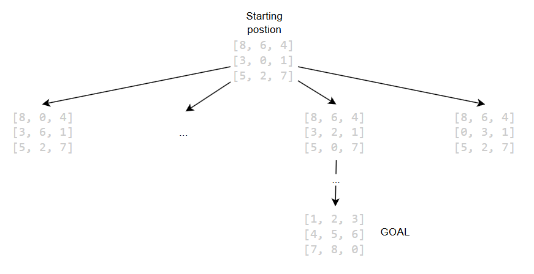

# 1. CI2024_lab3 - [N-Puzzle]

- [1. CI2024\_lab3 - \[N-Puzzle\]](#1-ci2024_lab3---n-puzzle)
  - [1.1. Lab's Objective](#11-labs-objective)
  - [1.2. The problem](#12-the-problem)
  - [1.3. Strategy](#13-strategy)
    - [1.3.1. The node](#131-the-node)
    - [1.3.2. The board](#132-the-board)
    - [1.3.3. The search](#133-the-search)
    - [1.3.4. The cost](#134-the-cost)
  - [1.4. Considerations](#14-considerations)
- [2. Credits](#2-credits)

## 1.1. Lab's Objective

> - Solve efficiently a generic `n2-1 puzzle` (also known as Gem Puzzle, Boss Puzzle, Mystic Square, etc.) using path-search algorithms
> - Cost: the total number of actions evaluated

## 1.2. The problem

> *Given a `n2-1 puzzle`, starting from a shuffled position, go back to un-shuffled solution with the `shortest path`.*



## 1.3. Strategy

I decided to try implementing an A*-like path finding.

### 1.3.1. The node

I used a dataclass to hold the node's data. Nodes and actions are the same thing in this implementation. In fact, evaluating avaiable actions means creating new nodes with exectued moves.

```py
@dataclass
class Action:
    board : np.ndarray # | Current board
    distance : int = 0 # | heuristic distance between the node and the solution
    depth : int = 0    # | tree's depth
```

### 1.3.2. The board

To hold data I decided to use an array and make my own utility to convert indices into x and y location in a matrix.

### 1.3.3. The search

I tryied to adapt to my data an `A* path finding algorithm` starting from this explanation [Spiegazione dell'algoritmo A* EASY (esempio)](https://www.youtube.com/watch?v=kEY1OxOj_CY&t=1s&ab_channel=HackingwithAI) and also this one [A* search algorithm](https://en.wikipedia.org/wiki/A*_search_algorithm).

### 1.3.4. The cost

In A* we have an `actual cost` and an `heuristic cost`. For the two I decided to use:

- actual cost: the node depth in the tree
- heuristic: the distance between the node's board and the solution's board
  - for this one, a better alternative can be using a `Manhattan Distance`.

## 1.4. Considerations

The algorithm work with small puzzle size (I tried up to 4). Maybe changing the data structure used can improve performance and computation time. Also, instead of a priority queue I sort a list making the code even slower. After some chatting with a colleague, we came up to a possible future solution of using a heap queue to hold first the node with lowest cost.

# 2. Credits

- Thanks to [Martina Plumari (s317612)](https://github.com/MartinaPlumari) who suggested me possible solution to my slow performances, like using an heap queue.
- [A* search algorithm](https://en.wikipedia.org/wiki/A*_search_algorithm)
- [Spiegazione dell'algoritmo A* EASY (esempio)](https://www.youtube.com/watch?v=kEY1OxOj_CY&t=1s&ab_channel=HackingwithAI)